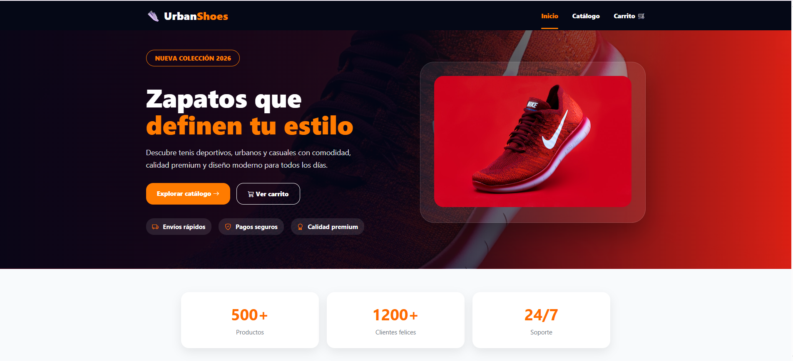
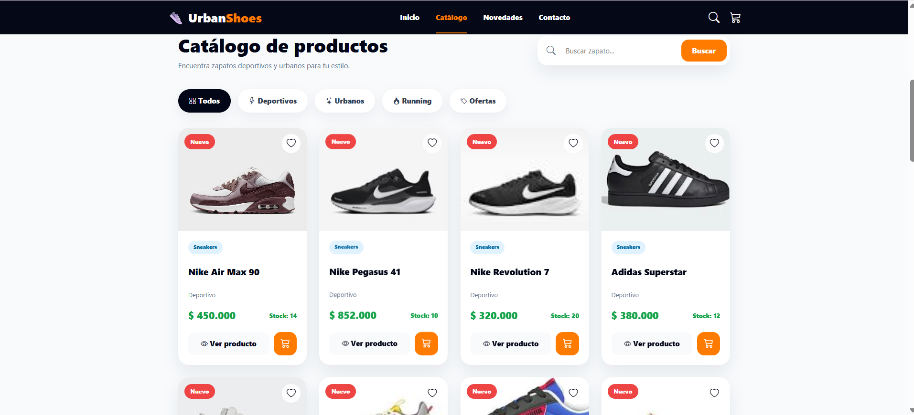
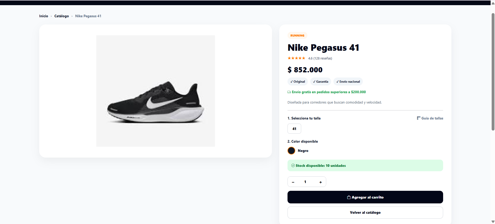
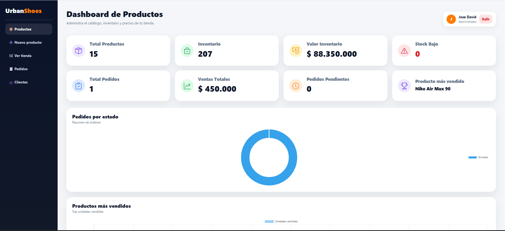

# UrbanShoes 👟

UrbanShoes es una tienda virtual de zapatillas desarrollada con Laravel, MySQL y Docker.  
El proyecto permite visualizar productos, agregarlos al carrito, generar pedidos y administrar el inventario desde un panel administrativo.

## Tecnologías utilizadas

- Laravel 12
- PHP
- MySQL
- Docker
- Blade
- Bootstrap Icons
- CSS personalizado
- JavaScript

## Funcionalidades principales

- Página de inicio
- Catálogo de zapatillas
- Detalle de producto
- Carrito de compras
- Formulario de pedido
- Confirmación de compra
- Factura
- Login administrador
- Dashboard administrativo
- Crear productos
- Editar productos
- Eliminar productos
- Control de stock
- Seeder con productos de prueba

## Arquitectura

- Laravel 12
- Patrón MVC
- Base de datos MySQL
- Docker
- Blade Templates
- Bootstrap Icons


## Instalación del proyecto

Clonar el repositorio:

```bash
git clone https://github.com/david101015/UrbanShoes.git
```

## Capturas del sistema

### Página de inicio



### Catálogo de productos



### Detalle de producto



### Dashboard administrativo



## Autor

Desarrollado por David Vásquez

GitHub:
https://github.com/david101015